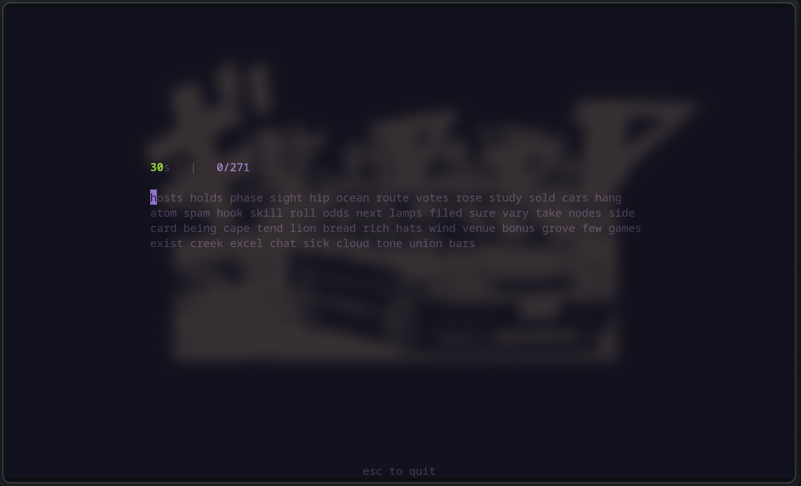
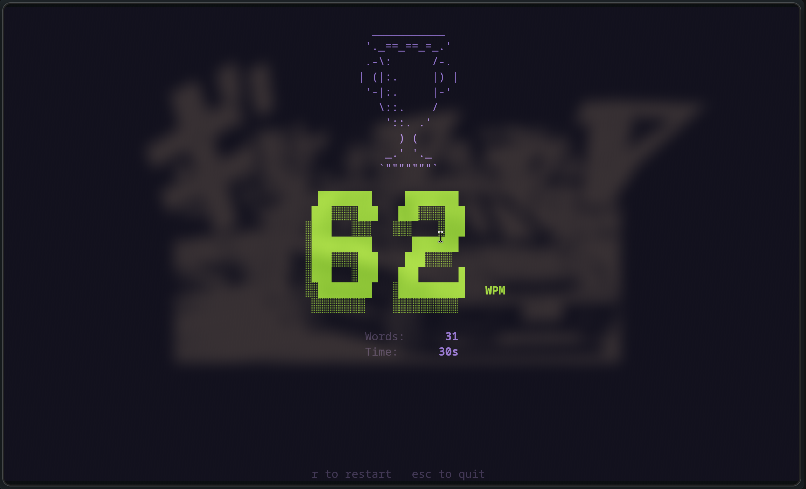

# ⌨️ TUI Typer

A clean, minimalist terminal typing test built in Rust using `ratatui` and `crossterm`.

This is just a fun little project I put together to test typing speeds without any extra bloat.

---

## 🎮 How to Play

Run the app, you will be greeted with your word list. The timer doesn't start until you type your first letter. It will record your typing and then show you your words per minute.





## Running the app

If you want to compile it yourself, make sure you have the Rust toolchain installed (via [rustup.rs](https://rustup.rs/)).

1. Clone the repository and navigate inside:

   ```bash
   git clone [https://github.com/your-username/tui-typer.git](https://github.com/your-username/tui-typer.git)
   cd tui-typer
